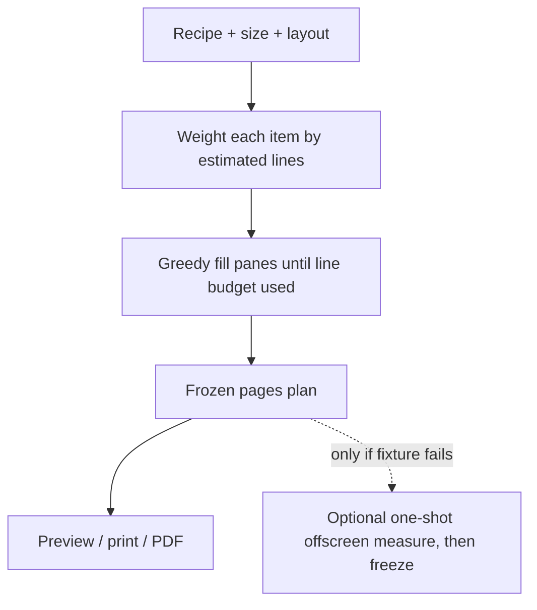

# Card Studio cutoff — deep scan & fix plan

**Date:** 2026-07-27  
**Fixture:** Easy Gazpacho (The Kitchn) — 13 ingredients, 7 long steps  
**Branch:** `feature/card-studio`  
**Status:** Implemented — classic card model (split when it fits; else ings → dirs). One measure pass, no page-count flicker.

---

## What the screenshots prove

| View | What you see | What’s really happening |
| --- | --- | --- |
| **5×7 Front** | Step 3 cut mid-sentence; ingredients jammed into footer | Packer put **all 7 steps** on page 1. CSS `overflow: hidden` hides steps 4–7 and the end of step 3. |
| **5×7 Back** | Orphan text (`of Sherry Vinegar…`), labels `Instead` / `Spices` / `Other` in the amount column, huge empty space | Only leftover ingredients; **no directions**. Amount column shows scraper `unit` values because `amount` is empty. |
| **Full page** | Step 7 kissing the bottom edge | Budgets allow everything on 1 page; still no height check, so long text packs to the clip line. |

Simulated packer output for this recipe (`layout: split`):

```
5x7  p1: 10 ings + 7 steps   ← impossible for a 5" pane; clipped
5x7  p2:  3 ings + 0 steps   ← empty right column, wasted card
letter p1: 13 ings + 7 steps ← one page, zero margin
```

---

## Root causes (not “more tuning”)

### 1. Item-count budgets ≠ physical height (primary)

`shared/cardPlan.js` packs by **item count** (e.g. 5×7 split = 10 ingredients + 7 steps per face).

Gazpacho steps are 100–400 characters each. Three of them fill a 5×7 directions pane; seven do not. The packer still assigns seven. The card then clips:

```css
.recipe-index-card__frame { overflow: hidden; }
.recipe-index-card__body  { overflow: hidden; }
```

**Counting items can never work** for recipes with uneven text length. This is why it “worked once” on short/medium recipes and fails on Gazpacho.

### 2. Aligned chunking wastes the back

Split rule today: page `i` = ings chunk `i` | dirs chunk `i`.

When ingredients need 2 pages and directions “fit” in the front budget (by count), page 2 gets ingredients only → empty right column while front directions are still clipped by height. Pagination and fit are **decoupled**.

### 3. Scraper + amount display (secondary, looks like “cutoff”)

Gazpacho notes were scraped as:

```json
{ "amount": "", "unit": "Instead", "name": "of Bread: handful…" }
{ "amount": "", "unit": "Whiz", "name": "these into the soup…" }
```

`formatAmount()` returns `unit` alone when `amount` is empty → bold left column shows “Instead”, name starts mid-phrase (“of Bread…”). Looks like a mid-line page break; it’s bad ingredient parsing/display.

### 4. Why measure-and-spill felt better, then worse

Earlier live DOM measure-and-spill **did** react to real height (so long steps spilled). It was removed because the **live refine loop** thrashed, fought CSS columns, and desynced PDF. The *idea* was right; the *continuous loop* was wrong.

The current shared packer fixed architecture (one plan, grid panes, client=server) but **regressed fit** by going back to naive counts.

---

## Target behavior (simple)



**Rules:**

1. Prefer an **extra page** over any clipped line.
2. **Two columns** = Ingredients pane | Directions pane (keep).
3. Fill each pane independently by **estimated height**, not item count.
4. Split pagination: keep filling **both** panes on each new page until both lists are exhausted (don’t leave directions stranded on a clipped front while the back is half-empty).
5. Plan is computed **once** and frozen. No live refine loop on chip clicks.
6. Same plan for preview, print, and server PDF.

---

## Recommended fix (minimal, not another architecture rewrite)

### Phase A — Line-weight packer (replace item counts)

**File:** `shared/cardPlan.js` (only packer logic changes)

For each size + layout, define a **line budget** for a body pane (calibrated once from real card CSS):

| Size | Split pane lines (approx) | Stacked body lines (approx) |
| --- | --- | --- |
| 4×6 | ~11–13 | ~14–16 |
| 5×7 | ~14–16 | ~18–20 |
| letter | ~42–48 | ~52–58 |

Subtract ~2 lines for each section heading present.

**Item cost:**

- Ingredient: `ceil(displayTextLength / charsPerLine) + rowGap`  
  - Split pane ~32–38 chars/line; stacked wider.  
  - Multi-line notes (150+ chars) cost 4–6 lines, not 1.
- Direction: `ceil(stepLength / charsPerLine) + rowGap`  
  - Long Kitchn steps cost 8–12 lines each.

**Greedy pack (split):**

```
while ings or dirs remain:
  page = { ings: [], dirs: [] }
  fill left pane with next ings until line budget full
  fill right pane with next dirs until line budget full
  push page
```

**Greedy pack (stacked):** fill one vertical budget with ings first, then dirs; new page when full.

**Success for Gazpacho 5×7:** Front might hold ~2 long steps + ~6–8 short ings; remaining steps continue on later pages — **no mid-sentence clip**. Back is not an empty-directions orphan while front is overflowing.

Calibrate with 3 fixtures: short taco salad, medium, Gazpacho. Prefer slight underfill.

### Phase B — Display fix for note-style ingredients

**Files:** `RecipeCardPrint.jsx`, `pdfGenerator.js` (`formatAmount` / list render)

If `amount` is empty and `unit` is not a real unit (or always when amount empty): treat `unit + name` as a **full-width** ingredient line (or merge into name). Stops “Instead / of Bread” two-column nonsense.

Optional later: scraper cleanup — out of scope for cutoff, but same fixture benefits.

### Phase C — Safety net only if Phase A still clips

**One-shot** offscreen measure after plan:

1. Render each planned face unscaled off-DOM once.
2. If a face overflows, spill last item to next page / new page.
3. Freeze. Never re-enter on page-chip changes.

Do **not** bring back the continuous CardStudio refine `useEffect`.

### Phase D — Keep what already works

Do not rewrite:

- CSS grid split panes
- Shared module import (client + server)
- Print packing / dashed borders / footer tags
- Frozen `useMemo` plan in CardStudio

---

## What we will not do

- Retune raw item counts (`ing: 10, step: 7`) again and hope
- Reintroduce live measure loops tied to `pageIndex`
- Bring back CSS `column-count` newspaper flow
- Cap at Front/Back only
- “Font scale until it fits” as the primary strategy (destroys readability)

---

## Implementation order

1. Replace `budgets()` item counts with line-weight greedy packer in `shared/cardPlan.js`.
2. Add a tiny `estimateLines(item, context)` helper + size constants; unit-test with Gazpacho + short recipe in Node.
3. Fix `formatAmount` / full-width note rows so Back doesn’t look mid-cut.
4. Manual Card Studio pass on Gazpacho: 4×6 / 5×7 / letter × split / stacked — screenshot no-clip checklist.
5. Only if needed: one-shot measure spill.

---

## Acceptance checklist (Gazpacho + one short recipe)

- [ ] 5×7 Two columns: no step cut mid-sentence; every step fully visible on some page
- [ ] 5×7 Back: no orphan “of Sherry…”, no `Instead`/`Spices` stuck in amount column
- [ ] Directions continue onto later pages instead of vanishing behind `overflow: hidden`
- [ ] Full page: either comfortable bottom margin **or** page 2 — never text through the footer
- [ ] Short recipe still 1 page
- [ ] Page chips stable (no flicker / replan)
- [ ] Client PDF page count matches preview

---

## Why this is simpler than what we have

Current system is “simple” code that is **wrong for real recipes**. The fix is one better packing function (weight by text length → fill line budget), plus a small display fix for bad units — not a new UI framework and not another live layout engine.
