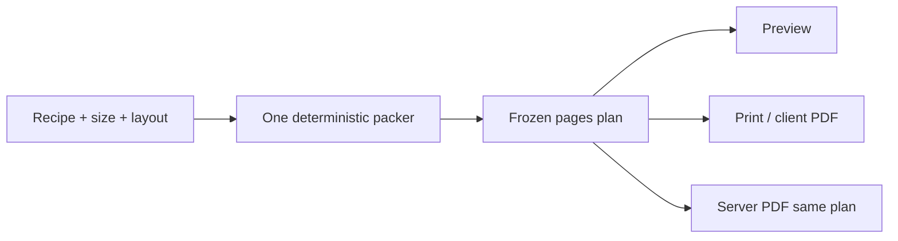

# Card Studio formatting — fix plan

Independent diagnosis after the recent pagination work caused more problems than it solved.

**Branch:** `feature/card-studio`  
**Status:** Implemented on `feature/card-studio` (shared packer + grid split + no live refine).

---

## Diagnosis (what’s actually wrong)

Three systems fight each other:

1. **Item-count packing** (`packStreamPages` / `pageLimits`) — guesses how many ingredients/steps fit
2. **CSS newspaper columns** (`column-count: 2`) — real geometry is different from those guesses
3. **Live measure-and-spill loop** in Card Studio — patches one item at a time after paint, re-runs on every plan/`pageIndex` change

Result: clipped content, sparse pages, “Two columns” that looks like Stacked, sluggish UI, and client preview ≠ server PDF.

“Two columns” today does **not** mean ingredients | directions. It means one flowing stream in CSS columns — which is why short recipes look identical to Stacked, and why Full page ingredients jump columns oddly.

---

## Target (boring and reliable)

### Product rules

| Control | Meaning |
| --- | --- |
| **Two columns** | True two panes: **Ingredients \| Directions** (CSS grid). Empty pane allowed if that page only has one section. |
| **Stacked** | Single column: ingredients, then directions. |
| **Pagination** | Prefer an extra page over clipping. Footer only: `Side N of 2` or `Page N of M`. No “continued” banners. |
| **Print** | 4×6 / 5×7: dashed cut guides, pack 2 per letter sheet. Full page: no dashed border, exactly one sheet per face. |

### Technical rules

- **One packer**, shared by client and server (or client PDF only — but no divergent `pageLimits` copies).
- **Compute plan once**, freeze it. Recompute only when recipe / size / layout / paper style change.
- **No live refine loop** depending on `plan` or `pageIndex`.
- Drop CSS `column-count` for cards.

### Packer approach (choose A)

**A — Deterministic line budgets (preferred)**  
Estimate capacity from known card body height + font/line-height. Pack ingredients into the left (or stacked) budget; pack directions into the right (or remaining) budget. Calibrate with 3–5 fixture recipes. Accept slight underfill.

**B — One-shot measure then freeze (fallback)**  
Render unscaled offscreen faces once, spill until fit, then freeze. Never re-enter the loop on chip clicks.

Start with **A**. Add B only if fixtures prove budgets can’t be calibrated.

---

## Implementation steps

### 1. Fix “Two columns” meaning

**Files:** `index.css`, `RecipeCardPrint.jsx`, `pdfGenerator.js`

- Replace `__body--split` newspaper columns with a **2-column grid**.
- Page content: ingredients section in left pane, directions in right pane.
- If a page has only ingredients or only directions, leave the other pane empty (or hide it cleanly).

**Success:** Toggling Two columns vs Stacked always looks different; Full page ingredients no longer “balance” into the right column with empty space below.

**Do not:** Tweak `column-fill` again.

### 2. Replace live spill with one frozen packer

**Files:** `CardStudio.jsx`, `RecipeCardPrint.jsx` (+ extract shared module if needed)

- Delete the `useEffect` refine loop (`detectCardOverflow` / `spillOneOverflowItem` continuous cycle).
- Implement `packRecipeCardPages(recipe, { size, layout })` that returns the final `pages[]`.
- For **split**: paginate each column with its own budget (ings pages and dirs pages can align as “page N has next ings + next dirs”, or continue dirs after ings are done on later pages — pick **aligned pages**: each page has a chunk of ings and a chunk of dirs until one list is exhausted).
- For **stacked**: chunk ings then dirs vertically across pages.

**Recommended split pagination rule (simple):**

1. Chunk ingredients into pages of `ingBudget(size)`.
2. Chunk directions into pages of `stepBudget(size)`.
3. Page `i` shows `ingsChunk[i]` | `dirsChunk[i]` (missing side empty).
4. Page count = `max(ingChunks, dirChunks)`.

**Success:** Opening studio yields a stable page count immediately; Front/Back chips don’t replan; no clip on fixture recipes.

**Do not:** Add more rAF/timeouts or raise refine caps.

### 3. Unify client and server

**Files:** new `client/src/utils/cardPlan.js` (or `shared/`), `pdfGenerator.js`, Card Studio export path

- One module for budgets + packer.
- Server imports the same logic (or receives the plan from the client). Prefer **shared module** if bundling allows; otherwise duplicate once carefully until shared.

**Success:** Same options → same page count in preview and PDF.

### 4. Print regression cleanup

**Files:** `index.css` `@media print`, client PDF path, `pdfGenerator.js`

- Keep dashed borders **only** for 4×6 / 5×7.
- Full page: zero page margin, exact 8.5×11, no dashed border, no blank second sheet.
- Remove contradictory `break-inside` rules on letter faces if they still risk an empty page.

**Success:** 1 full-page face → 1 printed sheet; 3× 4×6 faces → 2 sheets (2+1).

### 5. Dead code and UX cleanup

- Remove continued-banner CSS / `note` plumbing / unused `preferColumn`.
- Keep page chips under the preview; short hint only (no duplicate “Front/Back” essay).
- Footer tag remains the source of truth on the card.

### 6. Density pass (only after no-clip is solid)

- Loosen budgets slightly using fixture screenshots.
- Optional: if both columns’ remaining content fits on one page, merge — without bringing back a live loop.

---

## Fixture checklist (must pass before merge)

| Recipe profile | 4×6 split | 4×6 stacked | 5×7 split | Letter split |
| --- | --- | --- | --- | --- |
| Short (≤6 ings, ≤4 steps) | 1 page, both panes | 1 page | 1 page | 1 page, no dashed |
| Medium (Chicken Taco Salad–scale) | ≥2 pages if needed, no clip | ≥2 if needed | no clip | no clip, uses vertical space |
| Long ings + long steps | Multi-page, footer tags, no empty blank print sheet | same | same | same |

Also: UI stays responsive when clicking size / layout / page chips.

---

## What we will not do

- Stack more heuristics on top of caps + spill + CSS columns
- Measure the scaled preview for packing decisions
- Flip `column-fill` between `auto` and `balance` again
- Reintroduce “…continued” banners
- Ship server PDF that ignores the studio plan

---

## Why this should work better

Previous fixes kept the fragile architecture and only patched symptoms. This plan **removes the fight**: layout means what the UI says, pagination is one frozen computation, print rules stay simple. Density can be tuned later; correctness comes first.
